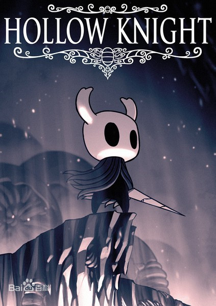
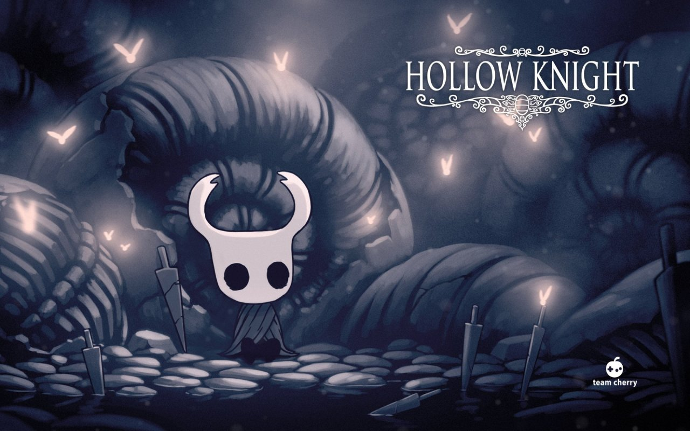
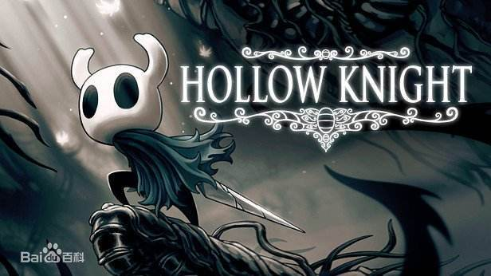
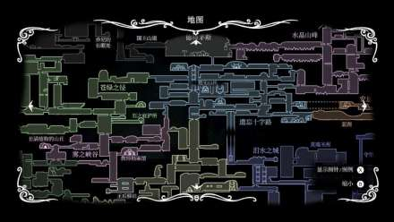

# hollow knight

《空洞骑士》是一款2D动作冒险游戏，开发者是来自澳大利亚的一个只有
三个人的小团队Team Cherry，2017年2月25日发售在PC平台。

## 游戏背景

 游戏背景设定在一个错综复杂的地下城“空洞巢穴”，我们的英雄在这个地
下王国内开始了他的历险，他需要利用自己的能力探索遗迹、消灭怪物或者
和一些怪物做朋友来帮助自己。游戏强调操作技巧和探索发现，拥有一定的
难度。

### 背景设定

该作讲述的是一个名为德特茅斯的衰落小镇下掩埋着一个古老的废弃王
国，名叫圣巢。这个王国被瘟疫所侵蚀而废弃，废弃的原因则是因为名为
辐光的光之古神，她可以通过思想来传播瘟疫，被瘟疫侵蚀的虫子都会被
本能所支配，失去心智。
这个王国的主人——苍白之王，自然不会坐视不管，他在圣巢范围之下的深
渊，利用另一种远古力量“虚空”可以压制光明的特性，制造了容器一族。
其中一位被选中的容器用来封印瘟疫，并被命名为空洞骑士。为了封印的
稳固，白王寻找了三个守梦人来进一步巩固封印，三位守梦人的名称分别
为守望者 - 卢瑞恩，导师 - 莫诺蒙，野兽 - 赫拉。但之后苍白之王不
知去向，不完美的容器的力量的也变得逐渐虚弱，最终被辐光控制。主角
就要穿过圣巢的各地，在安息之地中，我们受到曾经辐光的信徒和眷族——
飞蛾族唯一留下的族人的帮助，获得了和辐光力量同源的梦之武器——梦之
钉。梦之钉可以读取生物内心的想法，并可以打破守梦人的保护，进入到
其梦境之中杀死守梦人。杀死了三位守梦人并解开封印后，可选的结局有
到达十字路里的黑卵神殿打败空洞骑士或去到在“寻神者”更新中新加入的
地点“神居”并挑战圣巢万神殿。

### 角色设定

主角，游戏中并没有给该角色设定姓名或背景等，玩家唯一可操控的角色，在游戏中玩家可以操控他闯过不同的区域击杀不同的敌人来获得金钱、能力、游戏剧情的进展和地图的开放。游戏中共有13种不同的能力技能，作用各不相同，有主动也有被动。

## 场景地图

主角默认没有地图，每次进入新区域，要设法找到同时探险到那个区域的制图师，向其购买该区域的草图，否则得依靠自己记路的能力。
同时，因为只是“草图”，购买后仅显示制图师到过的区域，其他未知区域仍需要主角购买羽毛笔后在冒险过程中利用休息存档自行添加。
不同的区域需要玩家击杀特定的敌人后才能开启，有些地图也需要玩家获得相应的能力和钥匙后才能进入。

## 特色系统

### 战斗系统

在游戏中玩家角色的攻击方式只有普通攻击，玩家可以通过攻击按键攻击敌人，不同的敌人所受到的攻击各不相同，甚至会出现格挡弹反主角的敌人。
在游戏旅途中玩家可以获得不同的能力或护符来强化自身的攻击方式，可以进行多段攻击、蓄力攻击、旋风斩等。技能攻击需要消耗灵魂槽，灵魂槽可以通过击中敌人来增加。

## 游戏评测

《空洞骑士》是一个类银河恶魔城游戏，有着丰富的可探索内容和地穴。游戏所描绘的世界丰富、引人注目，充满等待挖掘的故事。探索的过程充满秘密和乐趣，还有和敌人的战斗过程，玩家在《空洞骑士》中花费的时间是值得的。
《空洞骑士》是一款非常容易令玩家纠结的横版过关类游戏。一方面它好看，好玩，故事有深度，另一方面，作为一款仅3人制作的独立游戏，它有制作者所极强的个人特点——可以称之为过分的难度。前者不断地引诱着玩家向前探索，领略更多的关卡内容和美丽的风景；后者则在探索路上从中作梗，设置一个个艰难障碍，让玩家进退两难。（游民星空评）
